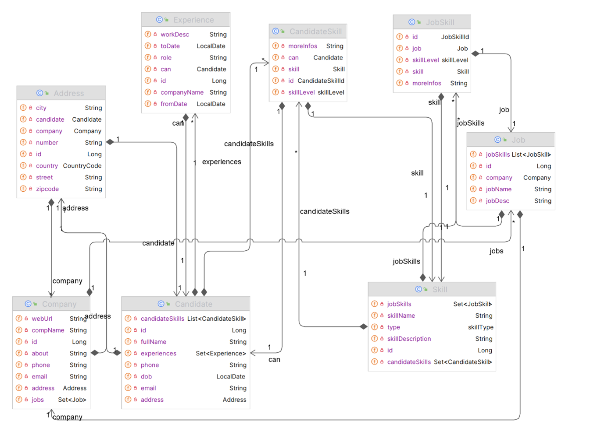
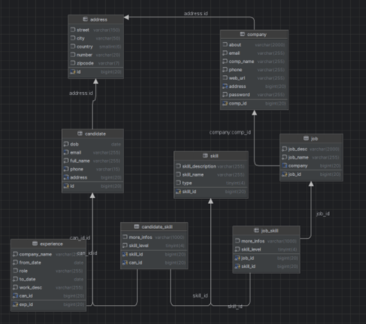

# Joppotunity - Hệ thống quản lý tuyển dụng

## Giới thiệu

Joppotunity là một trang web được thiết kế nhằm hỗ trợ việc quản lý và tổ chức thông tin liên quan đến ứng viên, công ty, và công việc một cách hiệu quả. Với giao diện thân thiện và nhiều tính năng hữu ích, hệ thống giúp cải thiện năng suất làm việc và tối ưu hóa quy trình tuyển dụng.

## Sinh viên thực hiện

- **Họ tên:** Phạm Đăng Khôi
- **Mã số sinh viên:** 21042951
- **Lớp:** DHKTPM17A
- **Giáo viên hướng dẫn:** Võ Văn Hải

## Tài liệu 
 - Word: [week_05_PhamDangKhoi_21042951_BaoCaoDeTai.docx](Document\week_05_PhamDangkhoi_21042951_BaoCaoDeTai.docx")
 - Powerpoint: 
## Công nghệ sử dụng

- **Backend:** Spring Boot, Spring Security, Spring Data JPA
- **Frontend:** Thymeleaf, HTML, CSS, JavaScript
- **Database:** MariaDB
- **Build Tool:** Gradle
- **IDE:** IntelliJ IDEA
- **Version Control:** Git, GitHub

## Yêu cầu hệ thống

### Phần cứng

- CPU: Intel Core i7
- RAM: 8GB trở lên
- Ổ cứng: SSD 256GB hoặc lớn hơn
- Màn hình: Độ phân giải Full HD (1920x1080) trở lên
- Kết nối Internet: Tốc độ ổn định

### Phần mềm

- Hệ điều hành: Windows 10/11, macOS hoặc Linux
- Java Development Kit (JDK): Phiên bản 8 hoặc cao hơn
- Database: MariaDB
- Trình duyệt: Google Chrome, Mozilla Firefox hoặc trình duyệt hiện đại khác

## Các chức năng chính

1. **Quản lý ứng viên**

   - Thêm mới và chỉnh sửa thông tin ứng viên.
   - Tìm kiếm và lọc ứng viên theo kỹ năng, kinh nghiệm.
   - Đề xuất công việc phù hợp và kỹ năng cần học.

2. **Quản lý công ty**

   - Thêm mới, chỉnh sửa thông tin công ty.
   - Xem danh sách và chi tiết thông tin các công ty.

3. **Quản lý công việc**

   - Tạo mới và cập nhật công việc.
   - Liên kết công việc với công ty liên quan.
   - Tìm kiếm và lọc công việc phù hợp với ứng viên.

4. **Tìm kiếm và lọc**
   - Tìm kiếm theo tên, vị trí, kỹ năng và nhiều tiêu chí khác.
5. **Gửi Mail ứng tuyển**
   - Gửi mail ứng tuyển cho ứng viên phù hợp

## Sơ đồ
### Class Diagram

### Database Diagram

## Giao diện website
### **Trang chủ**
   
### **Ứng viên**
**Danh sách ứng viên**
   
   
4. **Danh sách công ty**
   - Cung cấp thông tin về các công ty đã đăng ký.
5. **Quản lý công việc**
   - Tìm kiếm và tạo mới công việc phù hợp.

## Kết luận và hướng phát triển

Dự án đã cơ bản đáp ứng các yêu cầu đặt ra ban đầu, hỗ trợ hiệu quả trong việc quản lý tuyển dụng. Tuy nhiên, để hệ thống hoàn thiện hơn, các hướng phát triển bao gồm:

- Bổ sung tính năng đăng nhập và phân quyền người dùng.
- Tích hợp trí tuệ nhân tạo để gợi ý công việc và hỗ trợ người dùng tốt hơn.
- Phát triển ứng dụng di động để hỗ trợ đa nền tảng.
- Cải thiện bảo mật với xác thực hai yếu tố và mã hóa dữ liệu.
